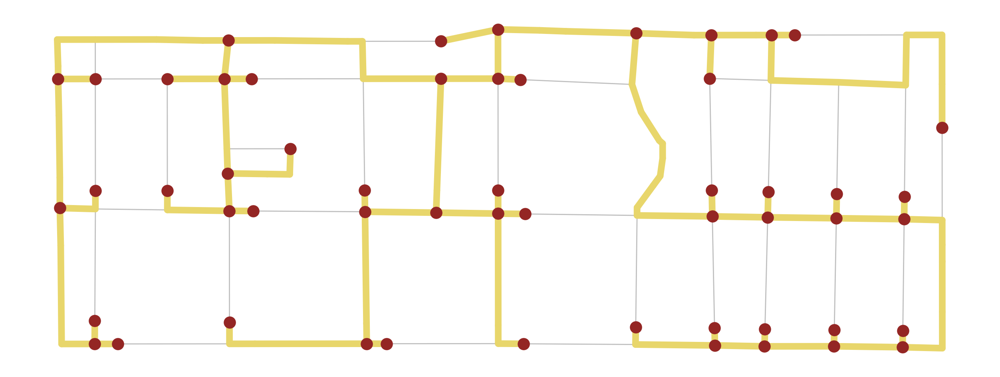

<p align="center">


</p>

# [pysal/spaghetti](http://pysal.org/spaghetti/)

# *SPA*tial *G*rap*H*s: n*ET*works, *T*opology, & *I*nference

Spaghetti is an open-source Python library for the analysis of network-based spatial data. Originating from the `network` module in [PySAL (Python Spatial Analysis Library)](http://pysal.org), it is under active development for the inclusion of newly proposed methods for building graph-theoretic networks and the analysis of network events.

*An example of a network's [minimum spanning tree](https://pysal.org/spaghetti/generated/spaghetti.spanning_tree.html#spaghetti.spanning_tree):*<p align="center">

</p>

|[](https://badge.fury.io/py/spaghetti)| [](https://anaconda.org/conda-forge/spaghetti) |  | [](https://mybinder.org/v2/gh/pysal/spaghetti/main)
|:---:|:---:|:---:|:---:|
|[](https://pepy.tech/project/spaghetti) | [](https://anaconda.org/conda-forge/spaghetti) | [](http://pysal.org/spaghetti/) | [](https://discord.gg/BxFTEPFFZn)
|  | [](https://github.com/conda-forge/spaghetti-feedstock) | [](https://codecov.io/gh/pysal/spaghetti) | [](https://github.com/astral-sh/ruff)
| [](https://github.com/pysal/spaghetti/actions/workflows/testing.yml) | [](https://joss.theoj.org/papers/52b8d0c81bbf311465b45bfc26379e74) | [](https://zenodo.org/badge/latestdoi/88305306) | [](https://opensource.org/licenses/BSD-3-Clause)

## Examples

The following are a selection of some examples that can be launched individually as interactive binders from the links on their respective pages. Additional examples can be found in the [Tutorials](https://pysal.org/spaghetti/tutorials.html) section of the documentation. See the [`pysal/notebooks`](http://pysal.org/notebooks) project for a [`jupyter-book`](https://github.com/choldgraf/jupyter-book) version of this repository.
* [Quickstart](https://pysal.org/spaghetti/notebooks/quickstart.html)
* [Shortest Path Visualization](https://pysal.org/spaghetti/notebooks/shortest-path-visualization.html)
* [Caveats](https://pysal.org/spaghetti/notebooks/caveats.html)

## Installation

Python >= [3.10](https://docs.python.org/3.10/) is tested for support by `spaghetti`. Please make sure that you are operating in a Python >= 3.10 environment.

**Installing with `conda` via [`conda-forge`](https://github.com/conda-forge/spaghetti-feedstock) (highly recommended)**

To install `spaghetti` and all its dependencies, we recommend using the [`conda`](https://docs.conda.io/en/latest/)
manager, specifically with the [`conda-forge`](https://conda-forge.org) channel. This can be obtained by installing the [`Anaconda Distribution`](https://docs.continuum.io/anaconda/) (a free Python distribution for data science), or through [`miniconda`](https://docs.conda.io/en/latest/miniconda.html) (minimal distribution only containing Python and the conda package manager). 

Using `conda`, `spaghetti` can be installed as follows:
```
$ conda config --set channel_priority strict
$ conda install --channel conda-forge spaghetti
```
Also, `geopandas` provides [a nice example](https://geopandas.readthedocs.io/en/latest/getting_started/install.html#creating-a-new-environment) to create a fresh environment for working with spatial data.

**Installing with [`PyPI`](https://pypi.org/project/spaghetti/)**
```
$ pip install spaghetti
```
*or* download the source distribution (`.tar.gz`) and decompress it to your selected destination. Open a command shell and navigate to the decompressed folder.
```
$ pip install .
```

***Warning***

When installing via `pip`, you have to ensure that the required dependencies for `spaghetti` are installed on your operating system. Details on how to install these packages are linked below. Using `conda` (above) avoids having to install the dependencies separately.

Install the most current development version of `spaghetti` by running:

```
$ pip install git+https://github.com/pysal/spaghetti
```

## Requirements

- [`esda`](https://pysal.org/esda/)
- [`geopandas`](https://geopandas.org/en/stable/)
- [`libpysal`](https://pysal.org/libpysal/)
- [`libspatialindex`](https://libspatialindex.org/en/stable/)
- [`numpy`](https://numpy.org/devdocs/)
- [`rtree`](https://rtree.readthedocs.io/en/stable/)
- [`scipy`](http://scipy.github.io/devdocs/)
- [`shapely`](https://shapely.readthedocs.io/en/stable/)

## History

`spaghetti` was 
created and has evolved in line with the Python Spatial Analysis Library ecosystem for 
the specific purpose of utilizing the functionality of spatial weights in 
[`libpysal`](https://pysal.org/libpysal/) for generating network segment contiguity objects. 
The PySAL project was started in the mid-2000s when installation was difficult to maintain. 
Due to the non-triviality of relying on dependencies to secondary packages, a conscious 
decision was made to limit dependencies and build native PySAL data structures in cases 
where at all possible. Therefore, the original `pysal.network` submodule was developed to 
address the need for integrating support for network data structures with PySAL weights 
data structures, with the target audience being spatial data scientists and anyone 
interested in investigating network-centric phenomena within PySAL. Owing to the 
co-development of network functionality found within `spaghetti` and the evolution of 
the wider PySAL ecosystem, today, the package provides specialized network functionality 
that easily integrates with the rest of PySAL. This allows users of `spaghetti`’s network 
functionality to access spatial analysis functionality that complements network analysis, 
such as spatial statistical tools with `esda` and integration with core components of 
`libpysal`: `libpysal.weights` (mentioned above), 
`libpysal.cg` (computational geometry and data structures), 
`libpysal.io` (input-output), and `libpysal.examples` (built-in example data).

##  Contribute

PySAL-spaghetti is under active development and contributors are welcome.

If you have any suggestions, feature requests, or bug reports, please open new [issues](https://github.com/pysal/spaghetti/issues) on GitHub. To submit patches, please review [PySAL's documentation for developers](https://pysal.org/docs/devs/), the PySAL [development guidelines](https://github.com/pysal/pysal/wiki), the `spaghetti` [contributing guidelines](https://github.com/pysal/spaghetti/blob/main/.github/CONTRIBUTING.md) before  opening a [pull request](https://github.com/pysal/spaghetti/pulls). Once your changes get merged, you’ll automatically be added to the [Contributors List](https://github.com/pysal/spaghetti/graphs/contributors).

## Support

If you are having issues, please [create an issue](https://github.com/pysal/spaghetti/issues), start a [discussion](https://github.com/pysal/spaghetti/discussions), or talk to us in [PySAL's Discord channel](https://discord.gg/BxFTEPFFZn). All questions, comments, & discussions should happen in a public forum, where possible. Private messages and emails will not be answered in a substantive manner.

## Code of Conduct

As a PySAL-federated project, `spaghetti` follows the [Code of Conduct](https://github.com/pysal/governance/blob/main/conduct/code_of_conduct.rst) under the [PySAL governance model](https://github.com/pysal/governance).

## License

The project is licensed under the [BSD 3-Clause license](https://github.com/pysal/spaghetti/blob/main/LICENSE.txt).

## BibTeX Citation

If you use PySAL-spaghetti in a scientific publication, we would appreciate using the following citations:

```
@article{Gaboardi2021,
    doi       = {10.21105/joss.02826},
    url       = {https://doi.org/10.21105/joss.02826},
    year      = {2021},
    publisher = {The Open Journal},
    volume    = {6},
    number    = {62},
    pages     = {2826},
    author    = {James D. Gaboardi and Sergio Rey and Stefanie Lumnitz},
    title     = {spaghetti: spatial network analysis in PySAL},
    journal   = {Journal of Open Source Software}
}

@misc{Gaboardi2018,
    author    = {Gaboardi, James D. and Laura, Jay and Rey, Sergio and 
                 Wolf, Levi John and Folch, David C. and Kang, Wei and 
                 Stephens, Philip and Schmidt, Charles},
    month     = {oct},
    year      = {2018},
    title     = {pysal/spaghetti},
    url       = {https://github.com/pysal/spaghetti},
    doi       = {10.5281/zenodo.1343650},
    keywords  = {graph-theory,network-analysis,python,spatial-networks,topology}
}
```

## Funding
This project is/was partially funded through:

[](https://atlantardc.wordpress.com) Atlanta Research Data Center: [A Polygon-Based Approach to Spatial Network Allocation](https://atlantardc.files.wordpress.com/2018/05/ardc-newsletter_2018_2.pdf)

[](https://www.nsf.gov/index.jsp) National Science Foundation Award #1825768: [National Historical Geographic Information System](https://www.nsf.gov/awardsearch/showAward?AWD_ID=1825768&HistoricalAwards=false)
